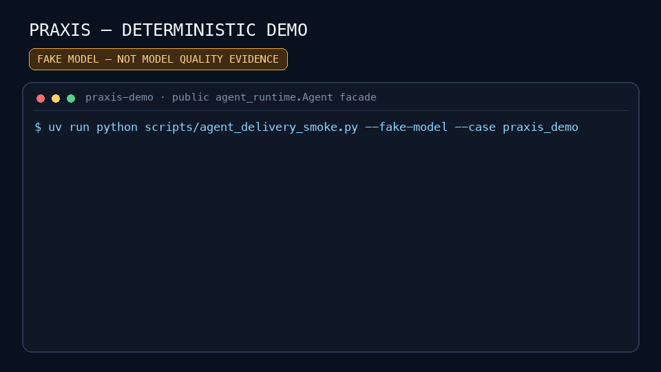

# Praxis

> **a trusted-local workspace agent runtime**

[](pyproject.toml)
[](LICENSE)
[](#quickstart)

Praxis turns a model's plan into controlled work on files, code, data, documents,
and private knowledge. For default modification tasks, the runtime requires a real
workspace change and post-change verification before accepting completion.
Read-only tasks explicitly opt out of that mutation contract and may answer
directly. Praxis is designed for one person operating a trusted local workspace,
with `agent` as the CLI and `agent_runtime.Agent` as the Python API.



**DETERMINISTIC DEMO · FAKE MODEL — NOT MODEL QUALITY EVIDENCE.** Every frame is
generated from the tested public Agent path. The scripted model inspects a file,
applies a patch, runs verification, and completes. It demonstrates runtime wiring
without credentials; real-model evidence is tracked separately.

## Why Praxis

Useful agent work is more than producing an answer:

```text
workspace knowledge -> controlled action -> verifiable result
```

Praxis keeps that path visible. The model can inspect the workspace, propose and
execute bounded tool calls, pause at approval boundaries, and continue from
durable state. Default modification turns finish against diff and verification
evidence. A read-only turn using `--no-require-workspace-change`, or the SDK with
`require_workspace_change=False`, may return analysis without manufacturing a
change. RAG is an optional private-knowledge capability, not the product's default
execution path.

## Runtime architecture

```text
CLI / Python SDK
       |
       v
Turn -> Loop -> ACI / ToolExecutor -> workspace
  |       |             |
  |       |             +-> approval before risky effects
  |       +-> model observation and bounded next step
  +-> checkpoint / resume / previous_turn_id
                       |
                       +-> verification and acceptance evidence
```

- **Turn** — one user request with one public `turn_id`; a later Turn may point
  to it through `previous_turn_id`.
- **Loop** — the bounded model/tool cycle that plans, observes results, and
  decides whether to continue, pause, fail, or finish.
- **ACI** — typed, documented tool contracts for files, search, patching,
  commands, plans, knowledge, skills, and integrations.
- **Approval** — write and execute capabilities remain distinct and can pause
  before a destructive effect.
- **Checkpoint** — pending and interrupted Turns persist so the same operation
  can resume instead of being replayed as a new task.
- **Verification** — a claimed workspace change is checked against the real diff
  and verification performed after the final mutation.

The runtime deliberately uses one Agent loop rather than a chain of role-playing
agents. Deeper lifecycle details are in the
[product contract](docs/design/agent_product_contract.md).

## Current evidence

| Evidence | What it establishes | Current state |
| --- | --- | --- |
| [Deterministic demo](docs/assets/praxis-demo.gif) | Public Agent wiring: inspect, patch, verify, finish | Reproducible fake-model artifact |
| [Model-quality benchmark](docs/benchmark.md) | Five capabilities, three trials each, evaluator and infrastructure status | **PASSED — 15/15 cases passed; worst-trial task success 100%**; worst-trial mean tool calls 1.6 |
| [Expanded DeepSeek V4 Flash run](docs/runs/deepseek-v4-flash.md) | Approval, continuation, mutation, validation, and redacted trace | **CONCLUSIVE PASS — 3/3 approval trials completed**; 2 tool calls per trial |
| [30-task protocol](evals/code_agent/benchmark_v1.json) | Manifest shape for a broader coding-agent evaluation | Manifest validated; not run as this change's release gate |

The model-quality pages are generated from a clean source commit after the local
gates pass. Infrastructure failures are reported as **INCONCLUSIVE**, never
converted into a model score. No test count is treated as proof that an Agent task
succeeded. The table reports the measured verdict and exact case count from the
linked raw report. A failed result would block model-quality and readiness claims
but would not overwrite deterministic runtime-gate results; inspect the expanded
trace for case-level evidence.

## Quickstart

### Install from a source checkout

The distribution name `praxis-agent-runtime` is local build metadata. This
project is **not published to PyPI**: use a source checkout or build a wheel
locally. There is no package-index install command implied by this README.

```bash
git clone https://github.com/xiaoyinglei/praxis-agent-runtime.git
cd praxis-agent-runtime
uv sync --frozen
```

Inspect the configured model aliases and choose one that is available in your
environment:

```bash
uv run agent model list
uv run agent model current
uv run agent model switch <model-alias>
```

Run a read-only task explicitly:

```bash
uv run agent run \
  "Read pyproject.toml and explain the public entry points." \
  --no-require-workspace-change
```

Read-only tasks can answer directly because `--no-require-workspace-change`
disables only the mutation requirement; it does not invent a verification claim.

For a task that may edit files or run verification, describe the outcome instead
of scripting tool names:

```bash
uv run agent run \
  "Add a typed timeout to the public API, update its tests, and verify the change."
```

Risky tool calls are presented for approval in an interactive terminal. A
non-interactive run pauses instead of silently approving them and prints the
`agent resume` command for the pending Turn.

### Python API

```python
from pathlib import Path

from agent_runtime import Agent

agent = Agent(
    model="<model-alias>",
    workspace_path=Path("."),
)
result = agent.run(
    "Read pyproject.toml and summarize the package boundaries.",
    require_workspace_change=False,
)

print(result.answer)
print(result.turn_id)
```

Use `previous_turn_id` for a new conversational Turn. Use `resume()` only for an
existing paused or interrupted Turn. Async applications can use `arun()`,
`astream()`, and `aresume()` on the same facade.

## Capability map

| Capability | Public route | Typical work |
| --- | --- | --- |
| **Files and code** | `agent` / `agent_runtime.Agent` | Discover, read, search, patch, inspect diffs, run bounded verification |
| **Data and documents** | Workspace tools plus Python execution | Inspect CSV, JSON, spreadsheets, PDFs, and document-derived artifacts |
| **Private knowledge** | Explicit `RAGKnowledgeConfig` | Retrieve cited evidence from a configured local knowledge index |
| **Extensions** | Workspace Skills, configured MCP servers, and bounded subagent delegation | Add installed ACI capabilities without replacing the core loop |

Capabilities are assembled for the current workspace. Availability does not
grant permission: tool visibility, write authority, command execution, network
access, and approval are separate controls.

## Optional RAG

The `rag` package and CLI handle ingestion, retrieval, storage, and diagnostics.
They are an optional provider boundary beneath Praxis—not an alternate Agent API.
An ordinary `agent run` does not initialize embedding, reranking, vector storage,
or knowledge services.

Attach private knowledge explicitly with a lazy provider:

```python
from agent_runtime import Agent, RAGKnowledgeConfig

knowledge = RAGKnowledgeConfig(
    storage_root="data/indexes/private_docs_v1",
    vector_backend="milvus",
    vector_collection_prefix="private_docs_v1",
)
agent = Agent(workspace_path=".", knowledge=knowledge)
result = agent.run(
    "Find the relevant policy evidence and summarize it.",
    require_workspace_change=False,
)
```

The RAG runtime initializes only when the model first calls the knowledge tool.
Index maintenance stays on the optional `rag` command:

```bash
uv run rag --help
```

See the [runbook](docs/RUNBOOK.md) for service and private-document workflows.

## Safety and limitations

Praxis targets a **trusted-local macOS/Python workspace**. Its controls reduce
accidental or unapproved effects; they do not turn hostile code, a malicious
repository, or an untrusted operator into a safe workload.

- Read/execute and workspace-write capabilities are distinct. Writes and command
  execution can require approval; `.git` mutations remain outside the default
  workspace-write boundary.
- Real `run_command` execution currently requires macOS
  `/usr/bin/sandbox-exec` and a Seatbelt profile. If that executable is absent,
  the tool will fail closed with `sandbox_unavailable`; on other platforms it is
  unavailable, and this repository has no equivalent command-sandbox safety
  evidence. The fake sandbox fixtures are test-only and are not safety evidence.
- RAG evidence quality depends on parsing, indexing, retrieval configuration, and
  the source documents. A citation is traceability, not automatic truth.
- Model and provider availability is external infrastructure. Timeouts, quota,
  authentication failures, and malformed responses are reported separately from
  task quality.
- Checkpoints may contain bounded task metadata and sanitized tool observations;
  they are local state and should be protected like the workspace.
- This repository is not a multi-tenant remote execution service, and the current
  evidence does not establish that deployment boundary.

## Development gates and deeper documentation

The repository's local and CI gates check formatting, types, imports, tests,
buildability, installed-wheel behavior, public CLI/SDK smoke paths, and the
deterministic demo. Run the same entry points from the checkout:

```bash
uv run ruff check .
uv run mypy
uv run lint-imports
uv run pytest -q
uv build
```

Focused references:

- [Runbook](docs/RUNBOOK.md) — models, services, private knowledge, and operations
- [Troubleshooting](docs/TROUBLESHOOTING.md) — common runtime and RAG failures
- [Product contract](docs/design/agent_product_contract.md) — public lifecycle and boundaries
- [Model-quality benchmark](docs/benchmark.md) — current live-evidence methodology and verdict
- [Expanded DeepSeek V4 Flash run](docs/runs/deepseek-v4-flash.md) — human-readable approval-continuation evidence
- [Evaluation archive](docs/EVALUATION.md) — historical retrieval baselines with provenance notes
- [MIT license](LICENSE) — use and redistribution terms

Praxis is available under the [MIT](LICENSE) license.
